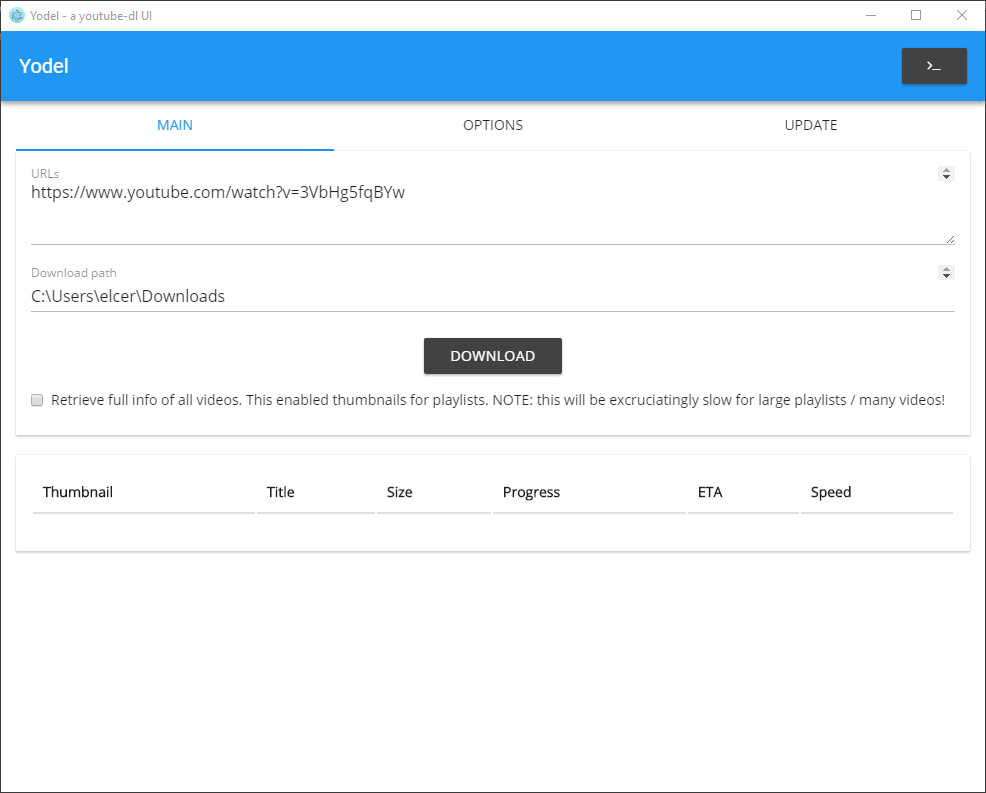
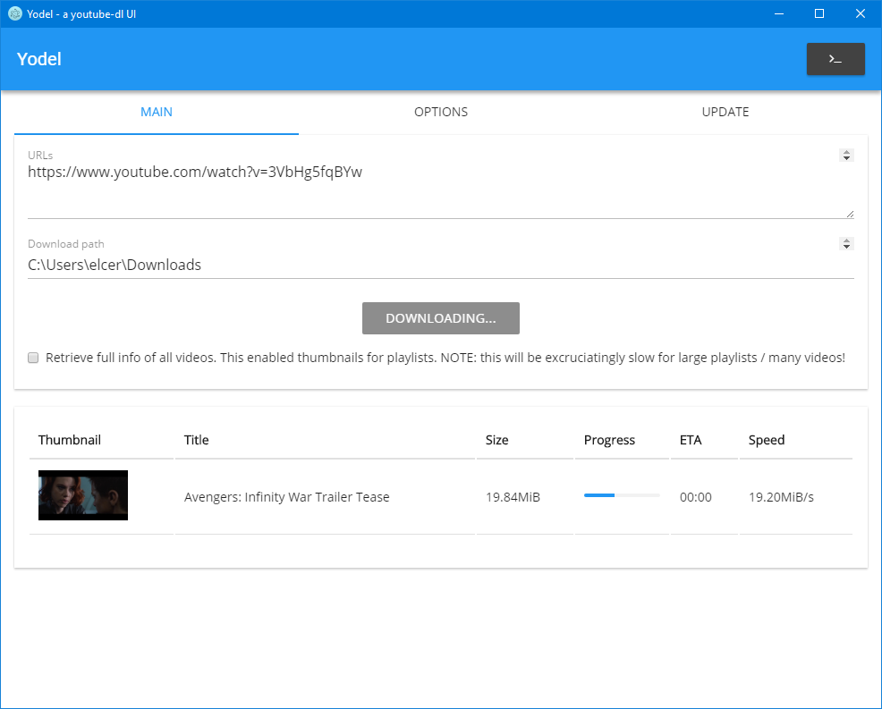
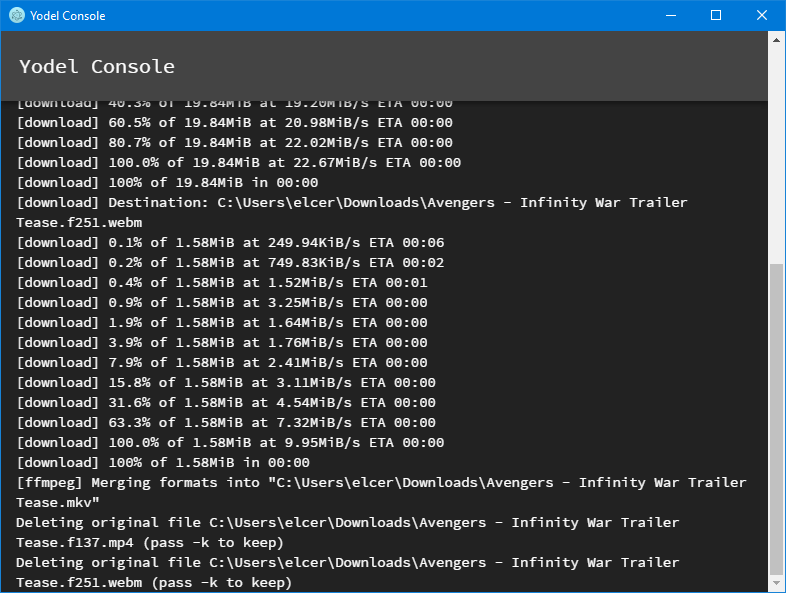

# Yodel
**CircleCI:** 

A cross-platform [Electron.NET](https://github.com/ElectronNET/Electron.NET) frontend for youtube-dl.

See the [main page](https://rg3.github.io/youtube-dl/) for youtube-dl for more information.

### Supported platforms
Theoretically, any Electron and .NET Core supported platform. Currently only tested on Windows.

### Screenshots
#### Main Window

#### Downloading a video

#### Console for extra information

### Contributing
All contributions are welcome. Electron.NET is still a very new framework and I'm new to Electron in general, so I'm sure I haven't written idiomatic Electron code. Any style corrections are welcome.

Development environment is Visual Studio 2017, NodeJS 8.6.x, and .NET Core 2.x.